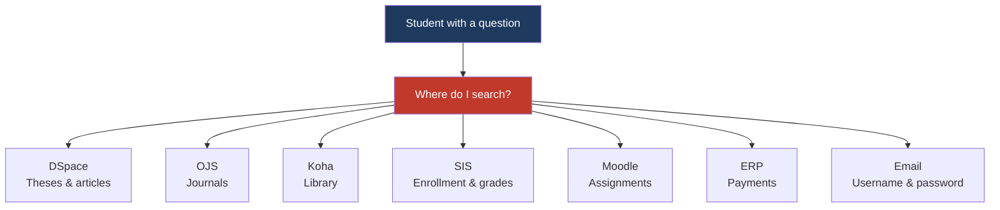
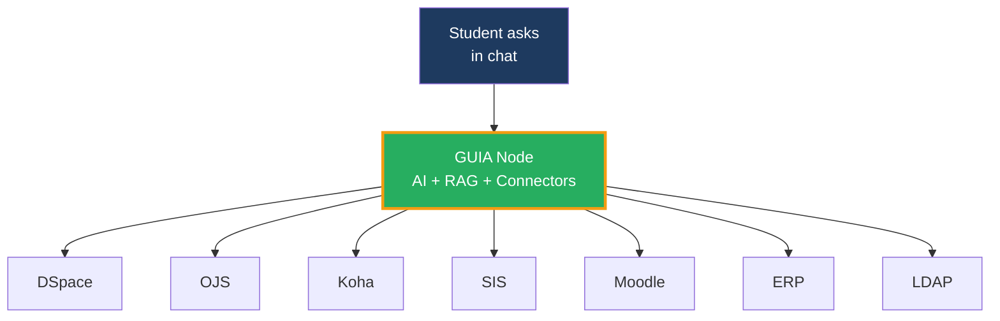

# GUIA

## Gateway Universitario de Informacion y Asistencia

*Open-source AI-native platform that unifies all university information into a single chat*

---

## The problem

Every university has 10+ disconnected systems. Students don't know where to look.

---

## The solution: GUIA

A single chat that connects all systems. Students ask in natural language, GUIA answers.

---

## Two products, one ecosystem

| Product | For whom | What it does |
|---------|---------|-------------|
| **GUIA Node** | Any university | AI assistant connecting all local systems |
| **GUIA Hub** | Consortia, networks, denominations | Federates nodes for unified research search |

---

## Open source

GUIA is open-core:

- **Core (Research):** Apache 2.0 — free forever
- **Campus connectors:** Commercial license (SciBack)
- **Managed support:** Monthly subscription

[:fontawesome-solid-arrow-right: Architecture](../arquitectura.md){ .md-button .md-button--primary }
[:fontawesome-solid-arrow-right: Business Model](../modelo-comercial.md){ .md-button }
