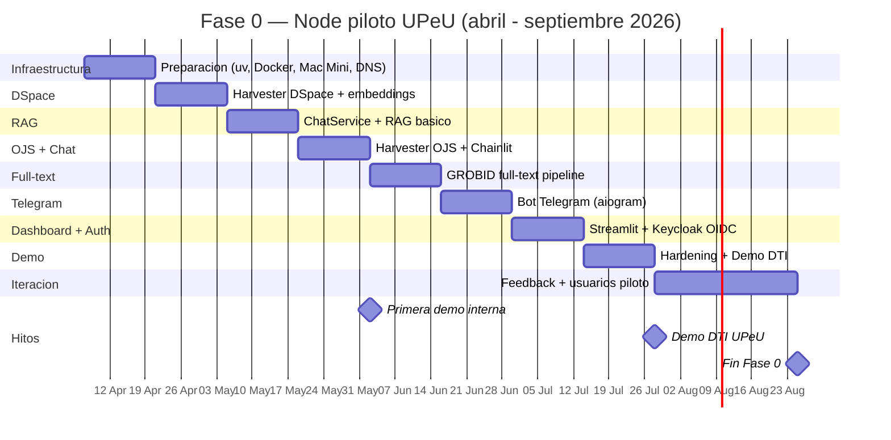

# Plan Operativo de Implementacion

## Principios

1. **sciback-platform primero** — los adapters DSpace, OJS, ALICIA, embeddings, pgvector y LLM ya estan construidos en `SciBack/platform`. GUIA los consume, no los reimplementa.
2. **Iterar manualmente antes de automatizar** — verificar cada paso
3. **Un entregable funcional por sprint** — cada 2 semanas algo se puede demostrar
4. **Community tier completo antes de vender Campus** — el core open source debe ser solido

---

## Estado de la plataforma (abril 2026)

`SciBack/platform` tiene 12 paquetes listos, 834 tests pasando. GUIA depende directamente de ellos:

| Paquete | Version | Lo que le ahorra a GUIA |
|---------|---------|------------------------|
| `sciback-adapter-dspace` | 0.1.0 | Harvester OAI-PMH DSpace + REST API + mapper DC |
| `sciback-adapter-ojs` | 0.1.0 | Harvester OAI-PMH OJS + REST API v3 |
| `sciback-adapter-alicia` | 0.1.0 | Validacion ALICIA 2.1.0 + DRIVER/COAR |
| `sciback-llm-claude` | 0.1.0 | Cliente Anthropic → LLMPort |
| `sciback-llm-ollama` | 0.1.0 | Cliente Ollama → LLMPort (Mac Mini M4) |
| `sciback-embeddings-e5` | 0.1.0 | multilingual-e5-large-instruct via Ollama |
| `sciback-vectorstore-pgvector` | 0.1.0 | pgvector + cosine similarity + IVFFlat |
| `sciback-core` | 0.11.0 | Dominio CERIF + puertos hexagonales |

**Consecuencia directa:** Sprint 0.1 y 0.2 son ~60% mas simples porque no hay que construir el harvester ni el cliente pgvector.

---

## Fase 0 — Node piloto UPeU (abril - septiembre 2026)

### Sprint 0.0 — Preparacion (sem 1-2)

**Objetivo:** Infraestructura base lista, proyecto Python inicializado.

| # | Tarea | Entregable | Criterio de aceptacion |
|---|-------|-----------|----------------------|
| 0.0.1 | Crear repos `SciBack/guia-node` (privado) | Repo GitHub con CI basico | Push + Actions verdes |
| 0.0.2 | Inicializar `guia-node` con `uv init` | `pyproject.toml` con deps de sciback-platform | `uv sync` resuelve sin error |
| 0.0.3 | Docker Compose base: postgres (pgvector) + redis + nginx | `docker-compose.yml` funcional | `docker compose up` levanta Postgres con `CREATE EXTENSION vector` |
| 0.0.4 | Mac Mini M4: Ollama + modelos + Caddy + API key | `ia.guia.upeu.edu.pe` responde | `curl http://ia.guia.upeu.edu.pe/api/tags` lista modelos |
| 0.0.5 | DNS + SSL: `guia.sciback.com` y `guia.upeu.edu.pe` | Certificados Let's Encrypt | `curl https://guia.sciback.com` responde 200 |

**`pyproject.toml` de guia-node:**
```toml
[project]
name = "guia-node"
version = "0.1.0"
requires-python = ">=3.13"
dependencies = [
    # Plataforma SciBack (instalar desde PyPI cuando se publiquen, o path local)
    "sciback-core>=0.11",
    "sciback-adapter-dspace>=0.1",
    "sciback-adapter-ojs>=0.1",
    "sciback-adapter-alicia>=0.1",
    "sciback-llm-claude>=0.1",
    "sciback-llm-ollama>=0.1",
    "sciback-embeddings-e5>=0.1",
    "sciback-vectorstore-pgvector>=0.1",
    # RAG + API
    "llama-index>=0.12",
    "fastapi>=0.115",
    "uvicorn[standard]>=0.32",
    "chainlit>=2.0",
    # Canales
    "aiogram>=3.15",
    # Cache + auth
    "redis>=5.0",
    "authlib>=1.3",
    "pyjwt>=2.9",
    # Config
    "pydantic-settings>=2.5",
]
```

---

### Sprint 0.1 — Harvester DSpace + indexacion (sem 3-4)

**Objetivo:** Cosechar metadatos de DSpace UPeU y generar embeddings en pgvector.

**Diferencia vs plan anterior:** No hay que implementar el harvester OAI-PMH. Se usa `DSpaceAdapter` y `AliciaHarvester` de sciback-platform directamente.

| # | Tarea | Entregable | Criterio de aceptacion |
|---|-------|-----------|----------------------|
| 0.1.1 | Confirmar endpoint OAI-PMH de DSpace UPeU | URL funcionando | `curl https://repositorio.upeu.edu.pe/oai?verb=Identify` retorna XML |
| 0.1.2 | Implementar `HarvesterService` usando `DSpaceAdapter` | Clase que cosecha y persiste | `HarvesterService().run()` inserta 1000+ publications |
| 0.1.3 | Validar con `AliciaHarvester` (11 campos ALICIA 2.1.0) | Reporte: % items validos | Saber cuantos items cumplen ALICIA (base del RAG) |
| 0.1.4 | Generar embeddings con `E5Adapter` → `PgVectorStore` | Items con embedding VECTOR(1024) en pgvector | `PgVectorStore.count()` retorna 1000+ |
| 0.1.5 | Script de verificacion | `python -m guia.cli harvest --dry-run` | Pipeline completo sin errores |

**Codigo clave (no boilerplate — lo interesante):**
```python
# src/guia/services/harvester.py
from sciback_adapter_dspace import DSpaceAdapter, DSpaceSettings
from sciback_adapter_alicia import AliciaHarvester, AliciaSettings
from sciback_embeddings_e5 import E5Adapter, E5Settings
from sciback_vectorstore_pgvector import PgVectorStore, PgVectorConfig

class HarvesterService:
    def __init__(self, config: GUIASettings) -> None:
        self._dspace = DSpaceAdapter(DSpaceSettings(base_url=config.dspace_base_url))
        self._e5 = E5Adapter(E5Settings(base_url=config.ollama_base_url))
        self._store = PgVectorStore(PgVectorConfig(database_url=config.pgvector_database_url))

    def run(self, *, from_date: str | None = None) -> int:
        count = 0
        for pub in self._dspace.harvest(from_date=from_date):
            texts = [pub.title, pub.abstract or ""]
            resp = self._e5.embed(texts)
            self._store.upsert(VectorRecord(
                id=pub.id,
                vector=resp.embeddings[0],
                payload={"title": pub.title, "handle": str(pub.handle)},
            ))
            count += 1
        return count
```

---

### Sprint 0.2 — RAG basico + ChatService (sem 5-6)

**Objetivo:** Busqueda semantica + respuesta LLM funcionando.

**Diferencia vs plan anterior:** No hay que configurar pgvector manualmente ni integrar sentence-transformers. `sciback-vectorstore-pgvector` y `sciback-embeddings-e5` ya lo hacen.

| # | Tarea | Entregable | Criterio de aceptacion |
|---|-------|-----------|----------------------|
| 0.2.1 | Implementar `SearchService` con `PgVectorStore` | Busqueda semantica `search(query, limit=5)` | Query "tesis contaminacion suelo" retorna items relevantes |
| 0.2.2 | Implementar `ChatService` con `LLMPort` | Selector de modo LOCAL / HYBRID / CLOUD | Chat funcional en los 3 modos |
| 0.2.3 | Endpoint FastAPI `POST /api/chat` | JSON `{query, response, sources}` | `curl -X POST /api/chat` responde en <5s |
| 0.2.4 | Intent classifier simple (Qwen 2.5 3B via Ollama) | 4 intents basicos: RESEARCH / CAMPUS / ACCION / UNKNOWN | Clasificacion correcta en 80%+ de queries de prueba |
| 0.2.5 | Cache semantico Redis | Hit rate medible | Misma query retorna respuesta en <200ms en el segundo intento |

**Codigo clave:**
```python
# src/guia/services/chat.py
from sciback_core.ports.llm import LLMPort, LLMMessage
from sciback_core.ports.vector_store import VectorStorePort

class ChatService:
    def __init__(self, llm: LLMPort, store: VectorStorePort) -> None:
        self._llm = llm
        self._store = store

    def answer(self, query: str) -> ChatResponse:
        results = self._store.search(self._embed(query), limit=5)
        context = "\n\n".join(r.payload["abstract"] for r in results if r.payload.get("abstract"))
        messages = [
            LLMMessage(role="system", content=SYSTEM_PROMPT),
            LLMMessage(role="user", content=f"Contexto:\n{context}\n\nPregunta: {query}"),
        ]
        resp = self._llm.complete(messages)
        return ChatResponse(content=resp.content, sources=[r.payload for r in results])
```

**Test de aceptacion:**
```
Pregunta: "Que tesis hay sobre contaminacion del suelo?"
Respuesta esperada: Lista de 3-5 tesis relevantes con titulo, autor, anio, handle.
Latencia: <5s incluyendo LLM.
```

---

### Sprint 0.3 — Harvester OJS + Chat web (sem 7-8)

**Objetivo:** OJS cosechado, Chainlit como interfaz de chat.

| # | Tarea | Entregable | Criterio de aceptacion |
|---|-------|-----------|----------------------|
| 0.3.1 | Confirmar endpoints OAI-PMH de revistas OJS UPeU | Lista de journals + URLs | `OjsAdapter` cosecha sin error |
| 0.3.2 | Extender `HarvesterService` con `OjsAdapter` | Articulos OJS en pgvector | Busqueda incluye articulos de revistas |
| 0.3.3 | Desplegar Chainlit como servicio Docker | Container `guia-chat` | `https://guia.sciback.com` muestra chat web |
| 0.3.4 | Integrar Chainlit con `ChatService` | Chainlit llama al backend | Chat funcional con streaming |
| 0.3.5 | Auth basica (anonimo o usuario/password) | Login opcional | Usuarios pueden chatear sin login |

**Hito: primera demo interna.**
> Abrir `https://guia.sciback.com`, preguntar "Que investigaciones hay sobre salud publica en la UPeU?", obtener respuesta con fuentes de DSpace y OJS.

---

### Sprint 0.4 — GROBID full-text (sem 9-10)

**Objetivo:** Texto completo de PDFs para mejorar calidad del RAG.

| # | Tarea | Entregable | Criterio de aceptacion |
|---|-------|-----------|----------------------|
| 0.4.1 | Agregar GROBID como servicio Docker | Container `grobid` en compose | GROBID responde en `http://grobid:8070` |
| 0.4.2 | Descargar PDFs via `DSpaceClient.get_item()` bitstream | PDFs en volumen Docker | PDFs disponibles localmente |
| 0.4.3 | Pipeline PDF → TEI XML → texto plano (grobid-client-python) | Texto extraido | Texto disponible para chunking |
| 0.4.4 | Chunking + embeddings de full-text | Nuevos `VectorRecord` con `source=full_text` | RAG usa full-text cuando disponible |
| 0.4.5 | Re-test calidad RAG | Comparar respuestas con y sin full-text | Respuestas mas precisas con full-text |

**Resultado esperado:**
```
Antes (solo abstract): "Hay 3 tesis sobre contaminacion del suelo."
Despues (full-text): "La de Flores (2024) encontro niveles de plomo de 45 mg/kg
en muestras de Junin, superando el ECA peruano de 70 mg/kg..."
```

---

### Sprint 0.5 — Telegram bot (sem 11-12)

| # | Tarea | Entregable | Criterio de aceptacion |
|---|-------|-----------|----------------------|
| 0.5.1 | Crear bot en BotFather | Token de bot `@guia_upeu_bot` | Bot registrado |
| 0.5.2 | Container `guia-telegram` con aiogram v3 | Bot responde a `/start` | Bot online |
| 0.5.3 | Conectar con `ChatService` | Misma logica RAG, canal diferente | Pregunta en Telegram → respuesta con fuentes |
| 0.5.4 | FSM para conversaciones con estado | Flujo: idioma → tipo busqueda → query | Bot guia al usuario en primera interaccion |
| 0.5.5 | Rate limiting por usuario (Redis) | Max 20 queries/hora | Evitar abuso de LLM |

---

### Sprint 0.6 — Dashboard + Keycloak (sem 13-14)

| # | Tarea | Entregable | Criterio de aceptacion |
|---|-------|-----------|----------------------|
| 0.6.1 | Dashboard Streamlit: items por anio, tipo, programa | `https://guia.sciback.com/dashboard` | Graficos con datos reales |
| 0.6.2 | Desplegar Keycloak + configurar realm UPeU | Container `keycloak` | Admin console accesible |
| 0.6.3 | Federar Keycloak con AD/LDAP o Google UPeU | User Federation configurada | Login con credenciales institucionales |
| 0.6.4 | Chainlit autentica via Keycloak OIDC | Login con credenciales UPeU | Usuario UPeU puede chatear autenticado |

---

### Sprint 0.7 — Hardening + Demo (sem 15-16)

| # | Tarea | Entregable | Criterio de aceptacion |
|---|-------|-----------|----------------------|
| 0.7.1 | Harvesting programado (cron cada 24h) | APScheduler o cron Docker | Nuevos items se indexan automaticamente |
| 0.7.2 | Logging estructurado JSON | Logs a stdout + CloudWatch | Trazabilidad de queries y errores |
| 0.7.3 | Health checks en Docker Compose | Todos los servicios healthy | `docker compose ps` todo verde |
| 0.7.4 | Backup automatizado PostgreSQL a S3 | Script + cron | Backup diario verificable |
| 0.7.5 | Video demo 3-5 min | Video para compartir | Demo lista |
| 0.7.6 | Reunion DTI UPeU | Presentacion + demo en vivo | Feedback documentado |

---

### Sprint 0.8 — Iteracion post-feedback (sem 17-20)

| # | Tarea | Entregable | Criterio de aceptacion |
|---|-------|-----------|----------------------|
| 0.8.1 | Fixes basados en feedback DTI | Issues resueltos | DTI confirma mejoras |
| 0.8.2 | Prueba con 10-20 usuarios piloto | Grupo activo | Usuarios reales haciendo queries |
| 0.8.3 | Metricas: queries/dia, latencia, satisfaccion | Dashboard de metricas | Datos para KPIs de Fase 1 |

---

## Fase 0 — Resumen visual



---

## Fase 1 — Node empaquetado (octubre - diciembre 2026)

**Objetivo:** Docker Compose reproducible, 2-3 universidades, primer revenue.

### Sprint 1.1 — Empaquetado

| # | Tarea | Entregable |
|---|-------|-----------|
| 1.1.1 | `docker-compose.yml` parametrizado con `.env` | Cambiar universidad = cambiar `.env` |
| 1.1.2 | Script de setup `./install.sh` | Primer run automatizado |
| 1.1.3 | Documentacion quickstart | "Levanta tu Node en 15 min" |
| 1.1.4 | Publicar `SciBack/guia-node` (Apache 2.0) | GitHub publico |
| 1.1.5 | Publicar paquetes `sciback-*` en PyPI | `pip install sciback-adapter-dspace` funciona |

### Sprint 1.2 — FunctionAgent + conectores Campus

| # | Tarea | Entregable |
|---|-------|-----------|
| 1.2.1 | Migrar a LlamaIndex FunctionAgent | Agente con QueryEngineTools (DSpace + OJS) |
| 1.2.2 | Conector Koha (guia-campus, privado) | FunctionTool para prestamos/deudas |
| 1.2.3 | Agente multi-tool: DSpace + OJS + Koha en 1 query | "Tengo libros vencidos y que tesis hay sobre mi tema?" |
| 1.2.4 | MCP Server del Node (datos publicos) | `fastapi-mcp` sobre endpoints existentes |
| 1.2.5 | Widget React embebible | `<script src="guia-widget.js">` en cualquier pagina |

### Sprint 1.3 — Primeros clientes

| # | Tarea | Entregable |
|---|-------|-----------|
| 1.3.1 | Pilotar en Universidad 2 | Node desplegado |
| 1.3.2 | Pilotar en Universidad 3 | Node desplegado |
| 1.3.3 | Primer contrato Campus Basic | Revenue real |
| 1.3.4 | CERIF: Person entities via DSpace REST | "Quien escribio esta tesis?" con perfil del autor |

---

## Fase 2 — Hub federado (H1 2027)

| # | Tarea | Entregable |
|---|-------|-----------|
| 2.1 | Hub federation broker (SaaS SciBack) | Queries cross-universidad |
| 2.2 | Servidor OAI-PMH del Hub (FastAPI, ~500 lineas) | `oai_dc` + `oai_openaire` + `dim` |
| 2.3 | Validar contra OpenAIRE Validator | Hub registrado en OpenAIRE |
| 2.4 | Conectores SIS y ERP (Campus Pro) | 2-3 integraciones activas |
| 2.5 | WhatsApp via pywa (Cloud API Meta) | Canal WhatsApp funcionando |
| 2.6 | CERIF completo: Project + Patent + Equipment | Inteligencia de investigacion |
| 2.7 | Metabase para dashboards | Bibliotecarios arman reportes propios |
| 2.8 | 10+ universidades, $5K/mes revenue | Escala LATAM |

---

## KPIs por fase

| Indicador | Fase 0 | Fase 1 | Fase 2 | Fase 3 |
|-----------|--------|--------|--------|--------|
| Universidades | 1 (UPeU) | 3-5 | 10+ | 50+ |
| Items indexados | 5K-10K | 30K+ | 100K+ | 500K+ |
| Queries/dia | 50 | 500 | 5,000 | 50,000 |
| Revenue mensual | $0 | $500 | $5,000 | $25,000+ |
| Canales | 2 (web + TG) | 2 | 3 (+WA) | 4 (+Teams) |
| Latencia | <5s | <3s | <3s | <2s |

---

## Riesgos y mitigaciones

| Riesgo | Probabilidad | Impacto | Mitigacion |
|--------|-------------|---------|-----------|
| DSpace UPeU sin abstracts completos | Media | Alto | Sprint 0.1 verifica cobertura. Si <50%, priorizar GROBID en Sprint 0.4 |
| DTI UPeU no aprueba piloto | Baja | Alto | Demo compelling + argumento cumplimiento ALICIA/Ley 30035 |
| API Claude costosa para volumen | Media | Medio | `GUIA_LLM_MODE=LOCAL` con Ollama como fallback |
| DSpace OAI-PMH lento/inestable | Baja | Medio | Harvesting incremental (desde ultima fecha), `DSpaceAdapter` ya lo maneja |
| GROBID no extrae bien PDFs escaneados | Alta | Medio | OCR previo (Tesseract) o Docling (IBM) como alternativa |
| paquetes sciback-* no en PyPI aun | Media | Medio | Instalar desde path local o git+https del repo privado |
| 1 desarrollador = bus factor 1 | Alta | Alto | Documentar todo, open source temprano para contributors |

---

## Checklist pre-arranque (antes de Sprint 0.0)

- [ ] `curl https://repositorio.upeu.edu.pe/oai?verb=Identify` responde con XML
- [ ] URLs OAI-PMH de las revistas OJS UPeU confirmadas
- [ ] Decidir EC2 para GUIA (existente AWS-DSpace o EC2 nuevo)
- [ ] Mac Mini M4: Ollama instalado + modelos descargados + Caddy configurado
- [ ] `source ~/.secrets/anthropic.env` da `ANTHROPIC_API_KEY`
- [ ] Dominio `guia.sciback.com` apuntando al EC2 de GUIA
- [ ] Repos `SciBack/guia-node` y `SciBack/guia-campus` creados
