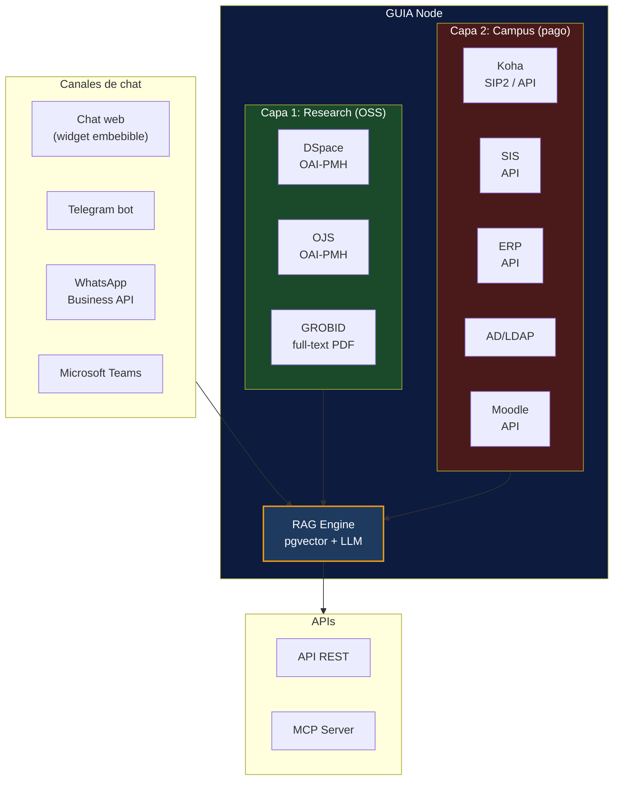
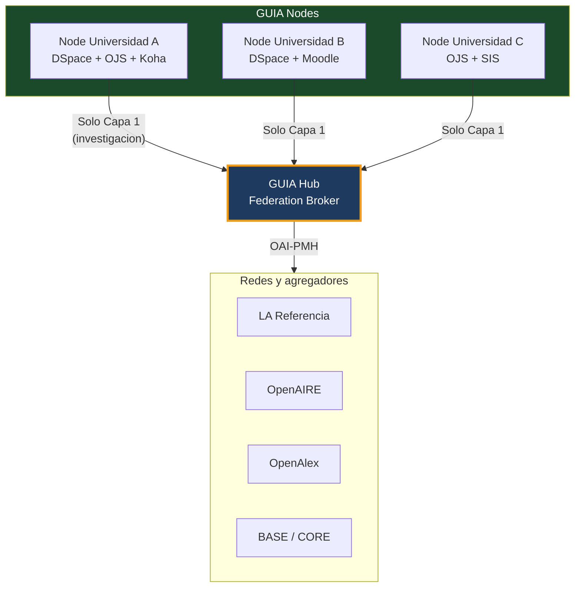
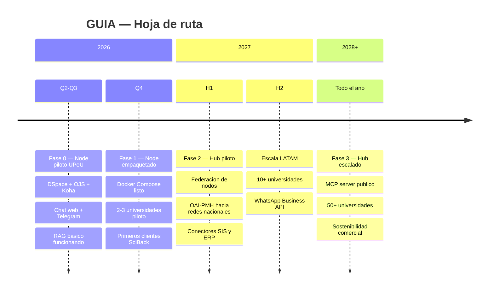

# Arquitectura

## GUIA Node — por universidad

Cada universidad instala un GUIA Node que conecta sus sistemas locales y expone un chat unificado.



---

## Stack tecnico

| Componente | Tecnologia | Notas |
|-----------|-----------|-------|
| Harvester | Python + pyoaiharvest | Cosecha OAI-PMH cada 24h |
| Full-text | GROBID | Extrae texto de PDFs cientificos |
| Embeddings | pgvector (PostgreSQL) | Vectores para busqueda semantica |
| RAG | LangChain / LlamaIndex | Orquestacion de retrieval + generacion |
| LLM | Claude API / Ollama local | Segun presupuesto del cliente |
| Chat web | Widget JS embebible | <script> tag en cualquier pagina |
| Telegram | python-telegram-bot | Gratis, sin costo de API |
| WhatsApp | WhatsApp Business API | Requiere cuenta Meta Business verificada |
| Deploy | Docker Compose | Un solo `docker compose up` |

---

## Interfaz de conectores

Cada conector implementa una interfaz estandar:

```python
class GUIAConnector:
    """Interfaz base para conectores GUIA."""

    def search(self, query: str, user_context: dict) -> list[Result]:
        """Busqueda semantica sobre el sistema conectado."""
        ...

    def get_user_info(self, user_id: str) -> dict:
        """Info personalizada del usuario (prestamos, notas, deudas)."""
        ...

    def get_status(self, user_id: str, entity: str) -> dict:
        """Estado de un proceso (tesis, articulo, pago)."""
        ...
```

Esto permite que cualquier desarrollador cree conectores nuevos para sistemas no cubiertos.

---

## GUIA Hub — por consorcio/red

El Hub agrega multiples Nodes para busqueda federada de investigacion.



**Funciones del Hub:**
- Federation broker: resuelve queries que un nodo local no puede
- Embeddings agregados de todos los nodos miembro
- OAI-PMH endpoint para compatibilidad con redes nacionales
- MCP server publico (corpus completo accesible desde agentes AI)
- Dashboard de visibilidad y analiticas

---

## Infraestructura (AWS)

Para el piloto UPeU:

| Servicio | Especificacion | Costo estimado |
|---------|---------------|----------------|
| EC2 | t3.xlarge (4 vCPU, 16GB RAM) | ~$120/mes |
| EBS | 100GB gp3 | ~$8/mes |
| S3 | Backups y PDFs | ~$5/mes |
| CloudWatch | Logs y alertas | ~$5/mes |
| **Total** | | **~$138/mes** |

Deploy: Docker Compose con Nginx reverse proxy + SSL (Let's Encrypt).

---

## Fases de desarrollo


