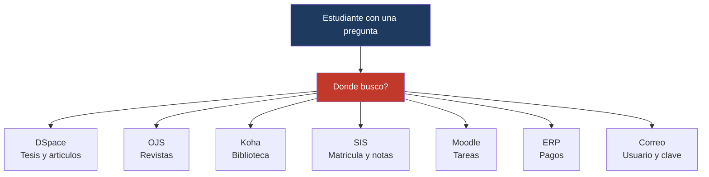
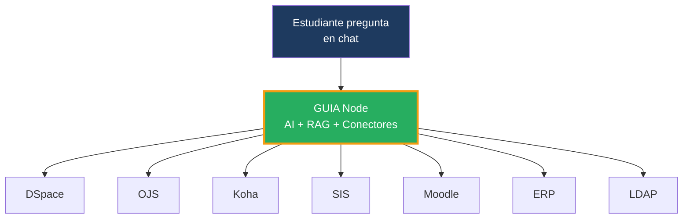
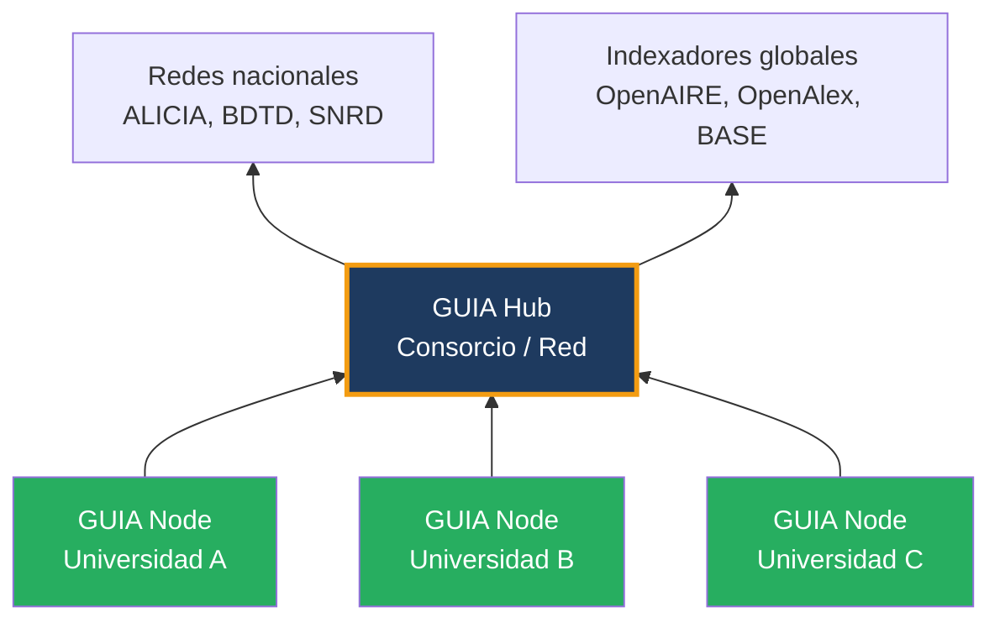

# GUIA

## Gateway Universitario de Informacion y Asistencia

*Plataforma open-source AI-native que unifica toda la informacion universitaria en un solo chat*

---

## El problema

Cada universidad tiene 10+ sistemas desconectados. Los estudiantes no saben donde buscar.

**Resultado:** frustacion, llamadas al helpdesk, informacion perdida, plataformas subutilizadas.

---

## La solucion: GUIA

Un solo chat que conecta todos los sistemas. El estudiante pregunta en lenguaje natural y GUIA responde.

---

## Ejemplos de uso

-   :fontawesome-solid-search: **Investigacion**

    "Que tesis hay sobre inteligencia artificial en educacion?"
    "En que estado esta la publicacion de mi articulo en la revista?"

-   :fontawesome-solid-book: **Biblioteca**

    "Tengo algun libro pendiente de devolver?"
    "Hay disponible el libro de Sampieri?"

-   :fontawesome-solid-graduation-cap: **Academico**

    "Cual es mi horario de clases?"
    "Ya salieron mis notas del parcial?"

-   :fontawesome-solid-credit-card: **Financiero**

    "Cuanto debo de matricula?"
    "Cual es la fecha limite de pago?"

-   :fontawesome-solid-envelope: **Institucional**

    "Cual es mi correo institucional?"
    "Como cambio mi contrasena?"

-   :fontawesome-solid-calendar: **Eventos**

    "Que congresos hay este mes?"
    "Donde me inscribo al simposio de investigacion?"

---

## Dos productos, un ecosistema

| Producto | Para quien | Que hace |
|----------|-----------|----------|
| **GUIA Node** | Cualquier universidad | Asistente AI que conecta todos los sistemas locales |
| **GUIA Hub** | Consorcios, redes, denominaciones | Federa nodos para busqueda unificada de investigacion |

!!! info "Separacion de datos"
    Los datos de campus (notas, pagos, prestamos) son **privados** y nunca salen del Node.
    Solo los datos de investigacion (tesis, articulos) federan hacia el Hub.

---

## Open source

GUIA es open-core:

- **Core (Research):** Apache 2.0 — gratuito para siempre
- **Conectores Campus:** Licencia comercial SciBack
- **Soporte gestionado:** Suscripcion mensual

[:fontawesome-solid-arrow-right: Arquitectura](arquitectura.md){ .md-button .md-button--primary }
[:fontawesome-solid-arrow-right: Modelo Comercial](modelo-comercial.md){ .md-button }
