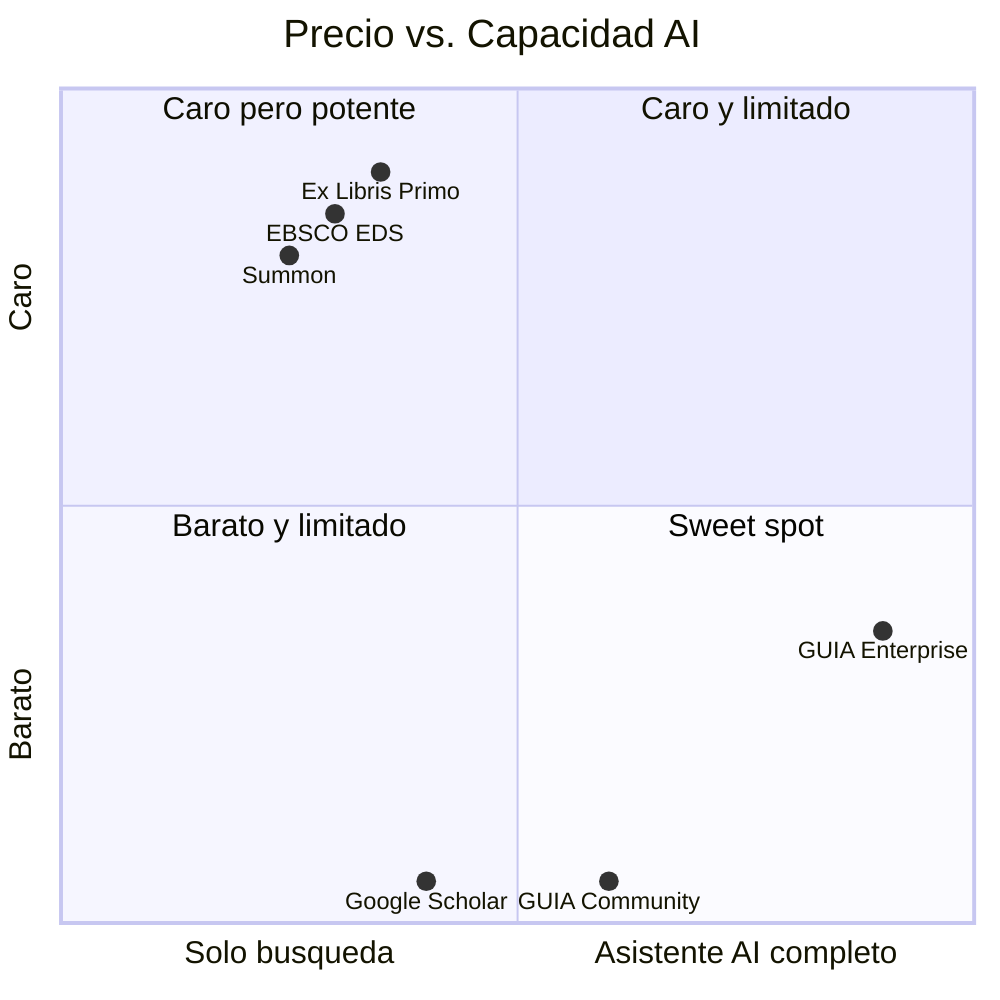

# Modelo Comercial

## Open-core: lo mejor de dos mundos

GUIA es open-core: el core de investigacion es gratuito y open source (Apache 2.0). Los conectores Campus y el soporte gestionado son productos comerciales de SciBack.

---

## Tiers

| Tier | Incluye | Precio |
|------|---------|--------|
| **Community** | Research core: DSpace + OJS + RAG + Chat web + Telegram | Gratis (Apache 2.0) |
| **Campus Basic** | + Koha + directorio LDAP | ~$100-200/mes |
| **Campus Pro** | + SIS + ERP + Moodle | ~$300-500/mes |
| **Campus Enterprise** | + WhatsApp + analytics avanzados + SLA | ~$500-1000/mes |
| **Hub** | Federacion de nodos + OAI-PMH + MCP server | ~$500-5000/mes |

---

## Comparacion con la competencia

| Producto | Precio anual | Modelo | Lo que hace |
|----------|-------------|--------|------------|
| EBSCO EDS | $20K-50K | Propietario | Busqueda facetada, solo papers |
| Ex Libris Primo | $30K-80K | Propietario (ProQuest) | Discovery, solo catalogo |
| Summon | Similar | Propietario | Similar a Primo |
| Google Scholar | Gratis | Solo papers publicos | Sin datos institucionales |
| **GUIA Community** | **Gratis** | **Open source** | **RAG + chat sobre tesis/articulos** |
| **GUIA Enterprise** | **~$12K** | **Open-core** | **AI conversacional + todos los sistemas** |

---

## Por que open source funciona aqui

1. **Adopcion:** Universidades publicas en LATAM no tienen presupuesto para EDS. Community gratis = adopcion masiva.
2. **Confianza:** Las universidades quieren auditar el codigo que procesa datos de estudiantes. Open source lo permite.
3. **Comunidad:** Conectores nuevos pueden venir de la comunidad (cada universidad tiene sistemas distintos).
4. **Revenue real:** El valor no esta en el codigo sino en el soporte, la integracion y los conectores Campus complejos (SIS, ERP).

---

## Pipeline de financiamiento complementario

Para el Hub federado y el desarrollo del core, GUIA puede acceder a grants:

| Fuente | Monto | Para que |
|--------|-------|---------|
| IOI Fund | Hasta $1.5M | Hub federado open science |
| Mellon Foundation | $250K-500K | Core open source para educacion superior |
| SCOSS | Recurrente | Sostenibilidad cuando haya 50+ nodos |
| Fondos gubernamentales | Variable | Universidades en paises con mandato OA |

!!! success "Precedente"
    LA Referencia (red LATAM de repositorios, modelo similar al Hub GUIA) recibio $1.5M del IOI Fund en el ciclo inaugural 2025.

---

## Mercado objetivo

### Tier 1 — Universidades individuales (GUIA Node)
- 118+ universidades adventistas (primer vertical por red personal de Alberto)
- ~1,800 universidades en America Latina (mercado amplio)
- Universidades en paises sin acceso a EDS/Primo por costo

### Tier 2 — Consorcios y redes (GUIA Hub)
- Consorcios universitarios: ALTAMIRA (Peru), CINCEL (Chile), ANUIES (Mexico)
- Redes denominacionales: IASD, catolicas, jesuiticas
- Sistemas universitarios estatales
- Redes tematicas: salud, teologia, ingenieria
