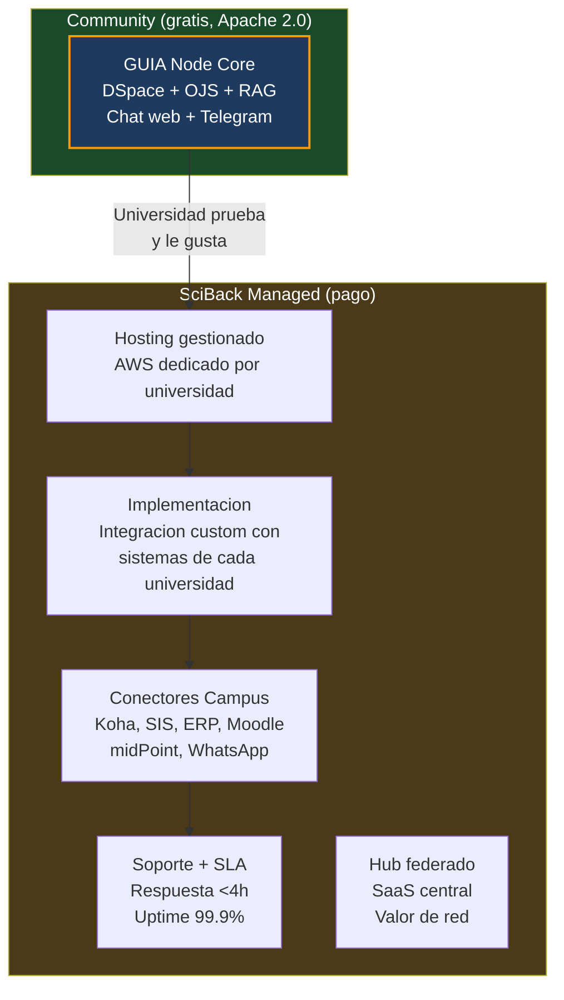
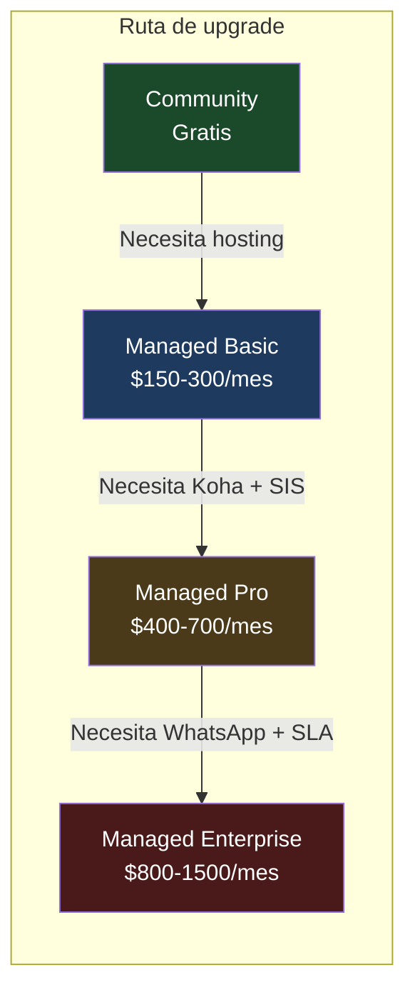
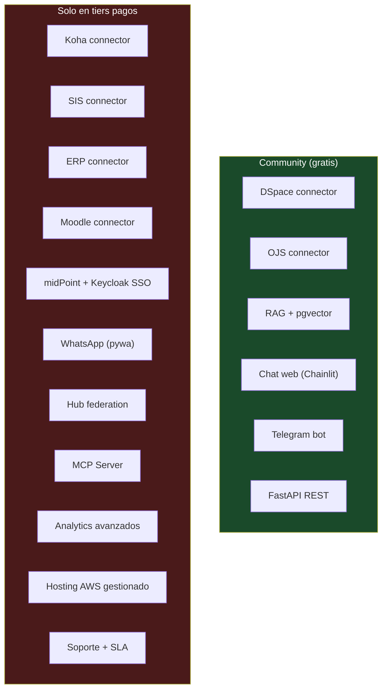
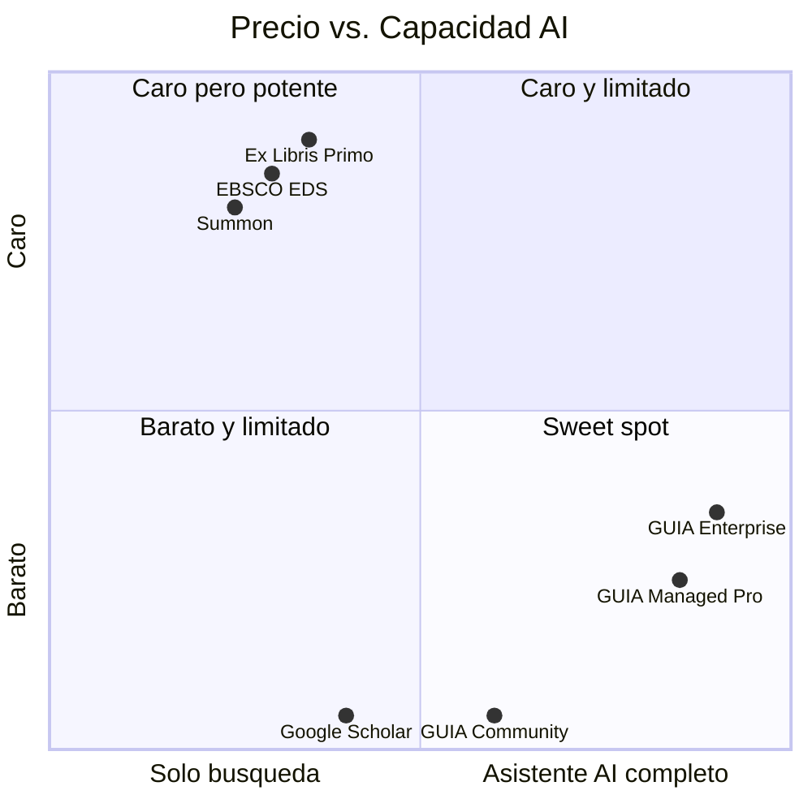

# Modelo Comercial

## El codigo es gratis. El servicio es el producto.

GUIA sigue el modelo open-core: el core de investigacion es gratuito y open source (Apache 2.0). SciBack vende **hosting gestionado**, **implementacion** y **conectores Campus** como servicios comerciales.

Modelo analogo a:

| Referencia | Gratis | Pago |
|-----------|--------|------|
| WordPress.org → WordPress.com | Software | Hosting gestionado |
| DSpace → DSpaceDirect (LYRASIS) | Software | Hosting + soporte |
| Keycloak → Red Hat SSO | Software | Soporte enterprise |
| **GUIA Community → SciBack Managed GUIA** | **Software** | **Hosting + implementacion + conectores** |

---

## Fuentes de revenue

### Por que pagan las universidades

| Fuente | Que vende SciBack | Por que la universidad paga |
|--------|-------------------|---------------------------|
| **Hosting gestionado** | SciBack despliega y mantiene el Node en AWS dedicado | No tienen DTI capaz de mantener Docker + pgvector + GROBID + SSL + backups |
| **Implementacion** | SciBack conecta GUIA a los sistemas de la universidad | Cada universidad tiene sistemas distintos — la integracion es custom |
| **Conectores Campus** | Codigo privado: Koha, SIS, ERP, Moodle, midPoint | No estan en el core open source — requieren desarrollo especializado |
| **Soporte + SLA** | Respuesta <4h, uptime garantizado, actualizaciones | Produccion 24/7 necesita respaldo profesional |
| **Hub federado** | SaaS central que agrega nodos | Un Hub con 20 universidades es mas util que 20 nodos aislados |

---

## Tiers de pricing

| Tier | Incluye | Precio mensual | Precio anual |
|------|---------|---------------|-------------|
| **Community** | Core open source: DSpace + OJS + RAG + chat web + Telegram | Gratis | Gratis |
| **Managed Basic** | SciBack hospeda Node + DSpace + OJS + soporte email | $150-300 | $1.8K-3.6K |
| **Managed Pro** | + Koha + SIS/ERP + Keycloak SSO + midPoint | $400-700 | $4.8K-8.4K |
| **Managed Enterprise** | + WhatsApp + SLA 99.9% + analytics + soporte dedicado | $800-1500 | $9.6K-18K |
| **Implementacion** | Proyecto de integracion inicial (one-time) | — | $2K-5K |
| **Hub** | Federacion de nodos (SaaS) | $500-5000 | $6K-60K |

---

## Barrera de pago

Lo que el tier Community NO incluye (y por lo que las universidades pagan):

---

## Comparacion con la competencia

| Producto | Precio anual | Modelo | Lo que hace |
|----------|-------------|--------|------------|
| EBSCO EDS | $20K-50K | Propietario | Busqueda facetada, solo papers |
| Ex Libris Primo | $30K-80K | Propietario (ProQuest) | Discovery, solo catalogo |
| Summon | Similar | Propietario | Similar a Primo |
| Google Scholar | Gratis | Solo papers publicos | Sin datos institucionales |
| **GUIA Community** | **Gratis** | **Open source** | **RAG + chat sobre tesis/articulos** |
| **GUIA Managed Pro** | **$4.8K-8.4K** | **Open-core** | **AI conversacional + Koha + SIS + SSO** |
| **GUIA Enterprise** | **$9.6K-18K** | **Open-core** | **Todo + WhatsApp + SLA + analytics** |

---

## Estructura de repositorios

| Repo | Visibilidad | Contenido | Licencia |
|------|------------|-----------|----------|
| `SciBack/guia` | PUBLIC | Docs + landing + sitio web | — |
| `SciBack/guia-node` | PUBLIC | Core: harvester, RAG, DSpace, OJS, chat, API | Apache 2.0 |
| `SciBack/guia-campus` | PRIVATE | Conectores Campus + Hub + midPoint | Comercial |
| `UPeU-Infra/guia-upeu` | PRIVATE | Config deploy UPeU (.env, overrides) | — |

El core open source debe ser **genuinamente util** standalone. Si Community es pobre, nadie lo prueba y no hay pipeline de clientes.

---

## Pipeline de financiamiento complementario

Para el Hub federado y el desarrollo del core:

| Fuente | Monto | Para que |
|--------|-------|---------|
| IOI Fund | Hasta $1.5M | Hub federado open science |
| Mellon Foundation | $250K-500K | Core open source para educacion superior |
| SCOSS | Recurrente | Sostenibilidad cuando haya 50+ nodos |
| Fondos gubernamentales | Variable | Universidades en paises con mandato OA |

!!! success "Precedente"
    LA Referencia (red LATAM de repositorios, modelo similar al Hub GUIA) recibio $1.5M del IOI Fund en el ciclo inaugural 2025.

---

## Mercado objetivo

### Tier 1 — Universidades individuales (GUIA Node)
- 118+ universidades adventistas (primer vertical por red personal de Alberto)
- ~1,800 universidades en America Latina (mercado amplio)
- Universidades en paises sin acceso a EDS/Primo por costo

### Tier 2 — Consorcios y redes (GUIA Hub)
- Consorcios universitarios: ALTAMIRA (Peru), CINCEL (Chile), ANUIES (Mexico)
- Redes denominacionales: IASD, catolicas, jesuiticas
- Sistemas universitarios estatales
- Redes tematicas: salud, teologia, ingenieria

---

## Por que open source funciona aqui

1. **Adopcion:** Universidades publicas en LATAM no tienen presupuesto para EDS. Community gratis = adopcion masiva = pipeline de clientes pagos.
2. **Confianza:** Las universidades quieren auditar el codigo que procesa datos de estudiantes.
3. **Comunidad:** Conectores nuevos pueden venir de la comunidad (cada universidad tiene sistemas distintos).
4. **Revenue real:** El valor no esta en el codigo sino en el **hosting**, la **implementacion** y los **conectores Campus** complejos.
5. **Precedente:** DSpace es open source y LYRASIS vende DSpaceDirect. WordPress es open source y Automattic factura $500M/ano.
