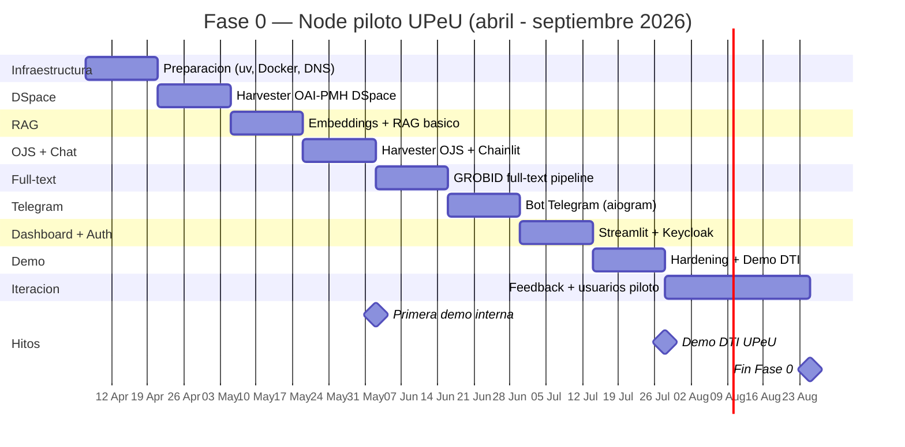

# Plan Operativo de Implementacion

## Principios

1. **DSpace + OJS primero** — es lo que el 90% de universidades LATAM ya tienen
2. **Iterar manualmente antes de automatizar** — verificar cada paso
3. **Un entregable funcional por sprint** — cada 2 semanas algo se puede demostrar
4. **Community tier completo antes de vender Campus** — el core open source debe ser solido

---

## Fase 0 — Node piloto UPeU (abril - septiembre 2026)

### Sprint 0.0 — Preparacion (sem 1-2: 7-18 abril)

**Objetivo:** Infraestructura base lista, proyecto Python inicializado.

| # | Tarea | Entregable | Criterio de aceptacion |
|---|-------|-----------|----------------------|
| 0.0.1 | Inicializar proyecto Python con `uv init` | `pyproject.toml` + `uv.lock` | `uv sync` funciona sin errores |
| 0.0.2 | Estructura de carpetas del Node | Arbol de directorios segun arquitectura | Estructura documentada en README |
| 0.0.3 | Docker Compose base: postgres (pgvector) + nginx | `docker-compose.yml` funcional | `docker compose up` levanta Postgres con pgvector habilitado |
| 0.0.4 | Configurar subdominio guia.sciback.com | DNS + SSL (Let's Encrypt) | `curl https://guia.sciback.com` responde |
| 0.0.5 | Crear repo `SciBack/guia-node` (privado, codigo fuente) | Repo GitHub con CI basico | Push + Actions verdes |

**Estructura de carpetas inicial:**

```
guia-node/
├── docker-compose.yml
├── pyproject.toml
├── uv.lock
├── .env.example
├─�� src/
│   ├── guia/
│   │   ├── __init__.py
│   │   ├── api/                # FastAPI app
│   │   │   ├── __init__.py
│   │   │   ├── main.py
│   │   │   └── routes/
│   │   ├── connectors/         # GUIAConnector implementations
│   │   │   ├── __init__.py
│   │   │   ├── base.py         # Interfaz abstracta
│   │   │   ├── dspace.py       # OAI-PMH via oaipmh-scythe
│   │   │   └── ojs.py          # OAI-PMH via oaipmh-scythe
│   │   ├── harvester/          # Pipeline de ingestion
│   │   │   ├── __init__.py
│   │   │   ├── oai.py          # OAI-PMH harvester
│   │   │   ├── normalizer.py   # DRIVER→COAR, validacion ALICIA
│   │   │   └── embedder.py     # LlamaIndex + pgvector
│   │   ├── rag/                # RAG engine
│   │   │   ├── __init__.py
│   │   │   └── engine.py       # LlamaIndex FunctionAgent
│   │   └── config.py           # Settings con Pydantic
│   └── tests/
├── docker/
│   ├── Dockerfile
│   ├── grobid/                 # Config GROBID
│   └── postgres/
│       └── init.sql            # CREATE EXTENSION vector
└── docs/
```

---

### Sprint 0.1 — Harvester DSpace (sem 3-4: 21 abril - 2 mayo)

**Objetivo:** Cosechar metadatos de DSpace UPeU y almacenarlos en PostgreSQL.

| # | Tarea | Entregable | Criterio de aceptacion |
|---|-------|-----------|----------------------|
| 0.1.1 | Identificar endpoint OAI-PMH de DSpace UPeU | URL confirmada, sets disponibles | `oaipmh-scythe` lista records sin error |
| 0.1.2 | Implementar `OAIHarvester` con oaipmh-scythe | Clase Python que cosecha records | Cosecha 100+ records en <60s |
| 0.1.3 | Implementar `Normalizer` (DRIVER→COAR, validacion ALICIA) | Funcion que normaliza un record | URIs COAR correctas, 11 campos obligatorios validados |
| 0.1.4 | Crear tabla `guia_item` en PostgreSQL | Migration SQL | Tabla creada con todos los campos del modelo canonico |
| 0.1.5 | Pipeline: harvest → normalize → INSERT | Script ejecutable | 1000+ items de DSpace UPeU en PostgreSQL |
| 0.1.6 | Verificar cobertura de abstracts | Reporte: % de items con abstract | Saber cuantos items tienen abstract (base del RAG) |

**Comando de verificacion:**
```bash
# Verificar que el harvester funciona
docker compose exec guia-api python -m guia.harvester.oai --source dspace-upeu --dry-run
# Verificar items en DB
docker compose exec postgres psql -U guia -c "SELECT count(*), resource_type FROM guia_item GROUP BY resource_type;"
```

**Dependencias de este sprint:**
```
oaipmh-scythe>=1.0.0
psycopg[binary]>=3.1
pydantic>=2.0
```

---

### Sprint 0.2 — Embeddings + RAG basico (sem 5-6: 5-16 mayo)

**Objetivo:** Busqueda semantica funcionando sobre los items cosechados.

| # | Tarea | Entregable | Criterio de aceptacion |
|---|-------|-----------|----------------------|
| 0.2.1 | Configurar pgvector extension | `CREATE EXTENSION vector` en init.sql | Extension activa |
| 0.2.2 | Generar embeddings con multilingual-e5 | Script que embebe abstract+title | Embeddings VECTOR(1024) en `guia_item.embedding` |
| 0.2.3 | Crear indice IVFFlat para busqueda | Index en pgvector | Busqueda vectorial <100ms para 10K items |
| 0.2.4 | Implementar `LlamaIndex VectorStoreIndex` sobre pgvector | Modulo `rag/engine.py` | Query "tesis sobre contaminacion" retorna resultados relevantes |
| 0.2.5 | Endpoint FastAPI `POST /api/chat` | Ruta que recibe pregunta, retorna respuesta + fuentes | `curl -X POST /api/chat -d '{"query":"tesis sobre IA"}'` retorna JSON con respuesta y handles |
| 0.2.6 | Conectar Claude API como LLM | Config de LLM en settings | Respuestas generadas en espanol con citas |

**Dependencias adicionales:**
```
llama-index-core
llama-index-vector-stores-postgres
llama-index-llms-anthropic
llama-index-embeddings-huggingface
sentence-transformers
```

**Test de aceptacion:**
```
Pregunta: "Que tesis hay sobre contaminacion del suelo?"
Respuesta esperada: Lista de 3-5 tesis relevantes con titulo, autor, anio, handle.
Latencia: <5s incluyendo LLM.
```

---

### Sprint 0.3 — Harvester OJS + Chat web (sem 7-8: 19-30 mayo)

**Objetivo:** OJS cosechado, Chainlit como interfaz de chat.

| # | Tarea | Entregable | Criterio de aceptacion |
|---|-------|-----------|----------------------|
| 0.3.1 | Identificar endpoints OAI-PMH de revistas OJS UPeU | Lista de journals + URLs | Endpoints confirmados |
| 0.3.2 | Reusar `OAIHarvester` para OJS | Misma clase, config diferente | Articles de OJS en `guia_item` con `source_repo` distinto |
| 0.3.3 | Generar embeddings de items OJS | Pipeline embeds nuevos items | Busqueda incluye articulos de revistas |
| 0.3.4 | Desplegar Chainlit como servicio Docker | Container `guia-chat` | `https://guia.sciback.com` muestra chat web |
| 0.3.5 | Integrar Chainlit con FastAPI `/api/chat` | Chainlit llama al backend | Chat funcional con streaming de respuestas |
| 0.3.6 | Auth basica (usuario/password o anonimo) | Login opcional | Usuarios pueden chatear con o sin login |

**Hito: primera demo interna.**
> Abrir `https://guia.sciback.com`, preguntar "Que investigaciones hay sobre salud publica en la UPeU?", obtener respuesta con fuentes de DSpace y OJS.

---

### Sprint 0.4 — GROBID full-text (sem 9-10: 2-13 junio)

**Objetivo:** Extraer texto completo de PDFs para mejorar calidad del RAG.

| # | Tarea | Entregable | Criterio de aceptacion |
|---|-------|-----------|----------------------|
| 0.4.1 | Agregar GROBID como servicio Docker | Container `grobid` en compose | GROBID responde en `http://grobid:8070` |
| 0.4.2 | Descargar PDFs de items con bitstream accesible | Script que baja PDFs via DSpace REST API | PDFs almacenados en volumen Docker |
| 0.4.3 | Procesar PDFs con grobid-client-python | Pipeline: PDF → TEI XML → texto plano | Texto extraido para items con PDF accesible |
| 0.4.4 | Chunking de full-text con LlamaIndex | `SentenceSplitter` con overlap | Chunks de ~512 tokens con metadatos del item padre |
| 0.4.5 | Embeddings de chunks full-text | Embeddings en tabla separada o en `guia_item.full_text` | RAG usa full-text cuando esta disponible, abstract como fallback |
| 0.4.6 | Re-test de calidad RAG | Comparar respuestas con y sin full-text | Respuestas mas detalladas y precisas con full-text |

**Resultado esperado:**
```
Antes (solo abstract): "Hay 3 tesis sobre contaminacion del suelo."
Despues (full-text): "Hay 3 tesis. La de Flores (2024) encontro niveles de plomo 
de 45 mg/kg en muestras de Junin, superando el ECA peruano de 70 mg/kg..."
```

---

### Sprint 0.5 — Telegram bot (sem 11-12: 16-27 junio)

**Objetivo:** GUIA accesible via Telegram.

| # | Tarea | Entregable | Criterio de aceptacion |
|---|-------|-----------|----------------------|
| 0.5.1 | Crear bot en BotFather | Token de bot, username @guia_upeu_bot | Bot registrado |
| 0.5.2 | Implementar bot con aiogram v3 | Container `guia-telegram` | Bot responde a `/start` |
| 0.5.3 | Conectar bot con FastAPI `/api/chat` | Misma logica RAG, canal diferente | Pregunta en Telegram → respuesta con fuentes |
| 0.5.4 | FSM para conversaciones con estado | Flujo: idioma → tipo busqueda → query | Bot guia al usuario en la primera interaccion |
| 0.5.5 | Rate limiting por usuario | Max 20 queries/hora por usuario | Evitar abuso de API LLM |

---

### Sprint 0.6 — Dashboard + Keycloak (sem 13-14: 30 junio - 11 julio)

**Objetivo:** Visualizacion de produccion cientifica y autenticacion SSO.

| # | Tarea | Entregable | Criterio de aceptacion |
|---|-------|-----------|----------------------|
| 0.6.1 | Dashboard Streamlit: items por anio, por tipo, por programa | Container `guia-dashboard` | `https://guia.sciback.com/dashboard` muestra graficos |
| 0.6.2 | Top autores, top keywords, cobertura de abstracts | Metricas en el dashboard | Datos utiles para DTI/Biblioteca |
| 0.6.3 | Desplegar Keycloak como servicio Docker | Container `keycloak` | Admin console accesible |
| 0.6.4 | Configurar realm UPeU + OIDC | Realm con client para GUIA | Chainlit autentica via Keycloak |
| 0.6.5 | Federar con AD/LDAP o Google UPeU (segun lo que tengan) | User Federation configurada | Login con credenciales institucionales |

---

### Sprint 0.7 — Hardening + Demo (sem 15-16: 14-25 julio)

**Objetivo:** Estabilizar para demo a DTI UPeU.

| # | Tarea | Entregable | Criterio de aceptacion |
|---|-------|-----------|----------------------|
| 0.7.1 | Harvesting programado (cron cada 24h) | APScheduler o cron en Docker | Nuevos items se indexan automaticamente |
| 0.7.2 | Logging estructurado | Logs JSON a stdout, CloudWatch | Trazabilidad de queries y errores |
| 0.7.3 | Health checks en Docker Compose | Healthcheck por servicio | `docker compose ps` muestra todos healthy |
| 0.7.4 | Backup automatizado de PostgreSQL | Script + cron a S3 | Backup diario verificable |
| 0.7.5 | Grabar demo en video | Video de 3-5 min | Demo lista para presentacion a DTI |
| 0.7.6 | Reunir con DTI UPeU | Presentacion + demo en vivo | Feedback documentado, siguiente paso acordado |

---

### Sprint 0.8 — Iteracion post-feedback (sem 17-20: julio - agosto)

**Objetivo:** Incorporar feedback de DTI UPeU, estabilizar.

| # | Tarea | Entregable | Criterio de aceptacion |
|---|-------|-----------|----------------------|
| 0.8.1 | Fixes basados en feedback DTI | Issues resueltos | DTI confirma mejoras |
| 0.8.2 | Prueba con 10-20 usuarios piloto (estudiantes/docentes) | Grupo de prueba activo | Usuarios reales haciendo queries |
| 0.8.3 | Metricas de uso: queries/dia, tiempo respuesta, satisfaccion | Dashboard de metricas | Datos para KPIs |
| 0.8.4 | Documentar lecciones aprendidas | Doc interno | Base para Fase 1 |

---

## Fase 0 — Resumen visual



---

## Fase 1 — Node empaquetado (octubre - diciembre 2026)

**Objetivo:** Docker Compose reproducible, 2-3 universidades, primer revenue.

### Sprint 1.1 — Empaquetado (sem 1-4: octubre)

| # | Tarea | Entregable |
|---|-------|-----------|
| 1.1.1 | `docker-compose.yml` parametrizado con `.env` | Cambiar universidad = cambiar `.env` |
| 1.1.2 | Script de setup `./install.sh` | Primer run automatizado |
| 1.1.3 | Documentacion quickstart | "Levanta tu Node en 15 min" en docs/ |
| 1.1.4 | Publicar repo open source guia-node (Apache 2.0, solo Capa 1) | GitHub publico |

### Sprint 1.2 — FunctionAgent + conectores (sem 5-8: noviembre)

| # | Tarea | Entregable |
|---|-------|-----------|
| 1.2.1 | Migrar de RAG simple a LlamaIndex FunctionAgent | Agente con QueryEngineTools (DSpace + OJS) |
| 1.2.2 | Conector Koha (SIP2 o REST API) | FunctionTool para prestamos/deudas |
| 1.2.3 | Agente multi-tool: DSpace + OJS + Koha en 1 query | "Tengo libros vencidos y que tesis hay sobre mi tema?" |
| 1.2.4 | MCP Server basico del Node (datos publicos) | fastapi-mcp sobre endpoints existentes |
| 1.2.5 | Widget React embebible (reemplaza Chainlit) | `<script src="guia-widget.js">` en cualquier pagina |

### Sprint 1.3 — Primeros clientes (sem 9-12: diciembre)

| # | Tarea | Entregable |
|---|-------|-----------|
| 1.3.1 | Pilotar en Universidad 2 (red IASD o contacto directo) | Node desplegado en segunda universidad |
| 1.3.2 | Pilotar en Universidad 3 | Node desplegado en tercera universidad |
| 1.3.3 | midPoint para universidad con infra compleja (si aplica) | midPoint + Keycloak integrados |
| 1.3.4 | Primer contrato Campus Basic ($100-200/mes) | Revenue real |
| 1.3.5 | CERIF: Person entities via DSpace REST API | "Quien escribio esta tesis?" con perfil del autor |

---

## Fase 2 — Hub federado (H1 2027)

**Objetivo:** Federacion de nodos, OAI-PMH hacia redes nacionales, conectores Campus.

| # | Tarea | Entregable |
|---|-------|-----------|
| 2.1 | Hub federation broker (SaaS SciBack) | Queries cross-universidad funcionando |
| 2.2 | Servidor OAI-PMH del Hub (FastAPI custom, ~500 lineas) | `oai_dc` + `oai_openaire` + `dim` |
| 2.3 | Validar contra OpenAIRE Validator | Hub registrado en OpenAIRE |
| 2.4 | schema.org/JSON-LD en paginas publicas del Hub | Google Scholar indexa items |
| 2.5 | Conectores SIS y ERP (Campus Pro, custom por universidad) | 2-3 integraciones activas |
| 2.6 | WhatsApp via pywa (Cloud API Meta) | Canal WhatsApp funcionando |
| 2.7 | CERIF completo: Project + Patent + Equipment | Inteligencia de investigacion |
| 2.8 | Notificaciones proactivas (APScheduler + Telegram) | Alertas de libros por vencer, plazos de tesis |
| 2.9 | Metabase para dashboards no-tecnicos | Bibliotecarios arman sus propios reportes |
| 2.10 | 10+ universidades, $5K/mes revenue | Escala LATAM |

---

## Fase 3 — Hub escalado (2028+)

| # | Tarea | Entregable |
|---|-------|-----------|
| 3.1 | MCP Server publico del Hub | Agentes AI externos consultan repositorios LATAM |
| 3.2 | Multi-agente con handoff (AgentWorkflow o LangGraph) | Agentes especializados por dominio |
| 3.3 | Apache Superset para analytics del Hub | BI multi-universidad |
| 3.4 | Integracion LA Referencia / ALICIA directa | Hub como nodo de la red nacional |
| 3.5 | 50+ universidades, $25K+/mes revenue | Sostenibilidad comercial |
| 3.6 | Evaluar Paperclip para orquestacion multi-agente | Si hay 5+ agentes coordinados |

---

## KPIs por fase

| Indicador | Fase 0 | Fase 1 | Fase 2 | Fase 3 |
|-----------|--------|--------|--------|--------|
| Universidades | 1 (UPeU) | 3-5 | 10+ | 50+ |
| Conectores Research | 2 (DSpace + OJS) | 2 | 2 | 2 |
| Conectores Campus | 0 | 1 (Koha) | 3+ (SIS, ERP) | 5+ |
| Items indexados | 5K-10K | 30K+ | 100K+ | 500K+ |
| Queries/dia | 50 | 500 | 5,000 | 50,000 |
| Revenue mensual | $0 | $500 | $5,000 | $25,000+ |
| Canales de chat | 2 (web + TG) | 2 | 3 (+WA) | 4 (+Teams) |
| Latencia respuesta | <5s | <3s | <3s | <2s |

---

## Riesgos y mitigaciones

| Riesgo | Probabilidad | Impacto | Mitigacion |
|--------|-------------|---------|-----------|
| DSpace UPeU sin abstracts completos | Media | Alto (RAG pobre) | Sprint 0.1.6 verifica cobertura. Si <50%, priorizar GROBID |
| DTI UPeU no aprueba piloto | Baja | Alto | Demo compelling + argumento de cumplimiento ALICIA |
| API Claude costosa para volumen | Media | Medio | Ollama local como fallback. Embeddings ya son locales (e5) |
| DSpace OAI-PMH endpoint lento/inestable | Baja | Medio | Harvesting incremental (desde ultima fecha), cache local |
| Universidades no tienen Keycloak ni AD | Media | Bajo | Keycloak con usuarios locales como fallback |
| GROBID no extrae bien PDFs escaneados | Alta | Medio | OCR previo (Tesseract) o Docling como alternativa |
| 1 desarrollador = bus factor 1 | Alta | Alto | Documentar todo, open source temprano para atraer contributors |

---

## Checklist pre-arranque (antes de Sprint 0.0)

- [ ] Confirmar URL OAI-PMH de DSpace UPeU (probar con `curl`)
- [ ] Confirmar URLs OAI-PMH de revistas OJS UPeU
- [ ] Decidir: EC2 existente (AWS-DSpace) o EC2 nuevo para GUIA
- [ ] API key de Claude API disponible en `~/.secrets/anthropic.env`
- [ ] Dominio guia.sciback.com apuntando al EC2
- [ ] Cuenta GitHub `SciBack/guia-node` creada (privada por ahora)
